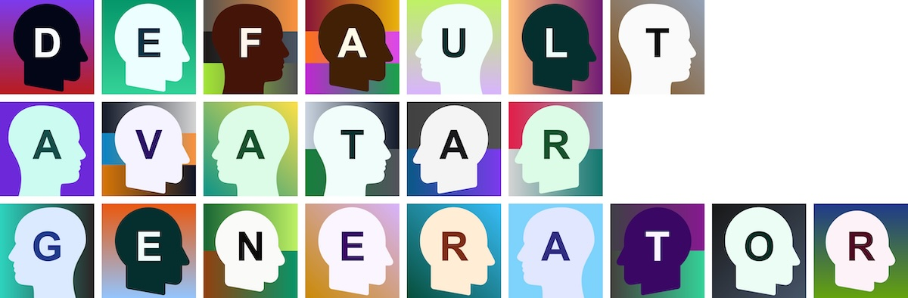

# Default Avatar Generator

[](https://github.com/pas256/default-avatar-generator/actions/workflows/ci.yml)
[](https://badge.fury.io/rb/default-avatar-generator)

A Ruby gem that generates beautiful default avatars for user accounts when no custom avatar is provided.

## Examples



## Installation

Add this line to your application's Gemfile:

```ruby
gem 'default-avatar-generator'
```

And then execute:

    $ bundle install

Or install it yourself as:

    $ gem install default-avatar-generator

## Usage

```ruby
require 'default_avatar_generator'

# Generate an avatar for a user
generator = DefaultAvatarGenerator::Generator.new(text: { character: "A" })
svg_avatar = generator.generate
jpeg_avatar = DefaultAvatarGenerator::ImageConverter.svg_to_jpeg(svg_avatar)
# Save the avatar to a file (if you need to)
```

## Development

After checking out the repo:

    bundle install
    ./viewer

This will bring up a development server on http://localhost:9292 where you can reload the page and keep generating new avatars.

To install this gem onto your local machine, run `bundle exec rake install`. To release a new version, update the version number in `version.rb`, and then run `bundle exec rake release`, which will create a git tag for the version, push git commits and the created tag, and push the `.gem` file to [rubygems.org](https://rubygems.org).

## Contributing

Bug reports and pull requests are welcome on GitHub. This project is intended to be a safe, welcoming space for collaboration, and contributors are expected to adhere to the [code of conduct](CODE_OF_CONDUCT.md).

## License

The gem is available as open source under the terms of the [MIT License](LICENSE).
